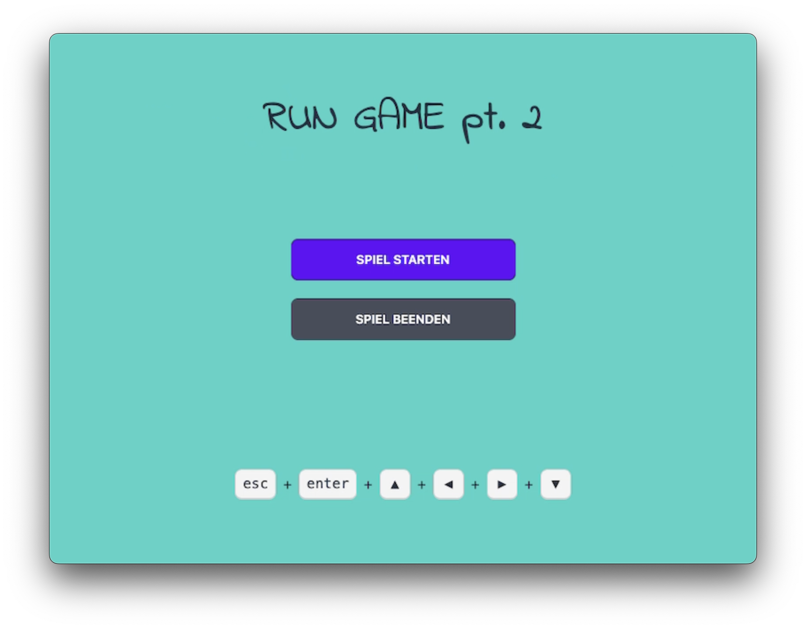
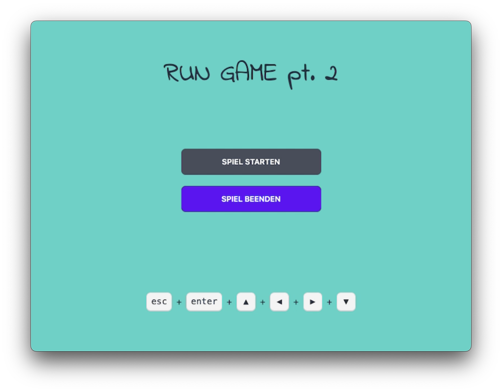
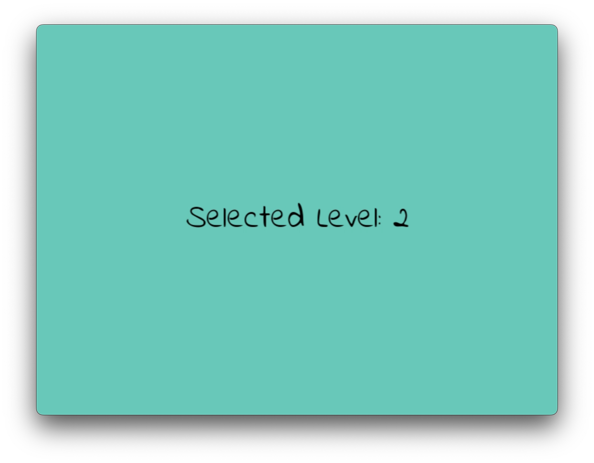
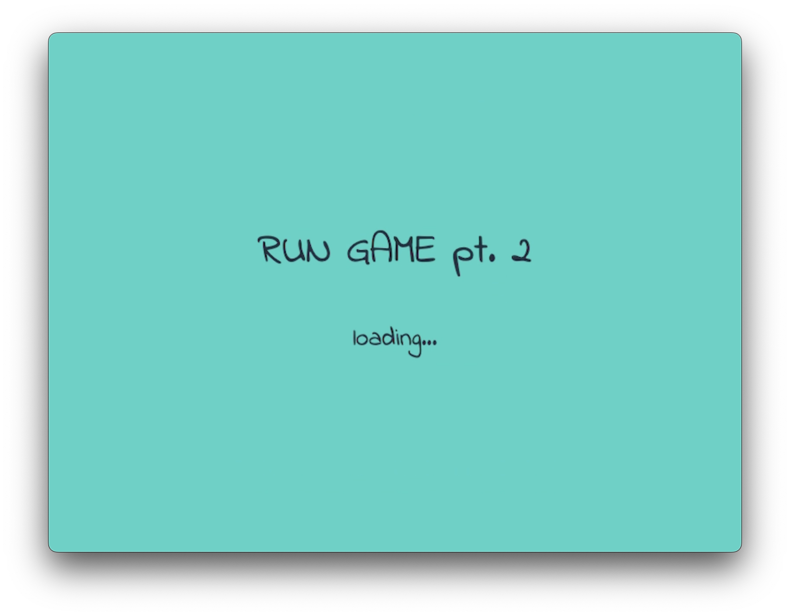
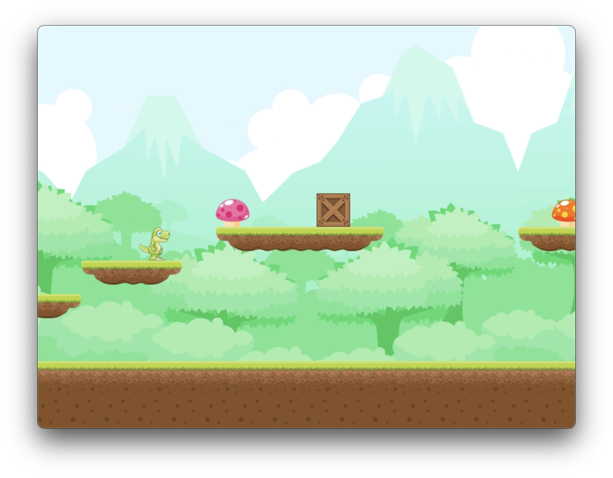
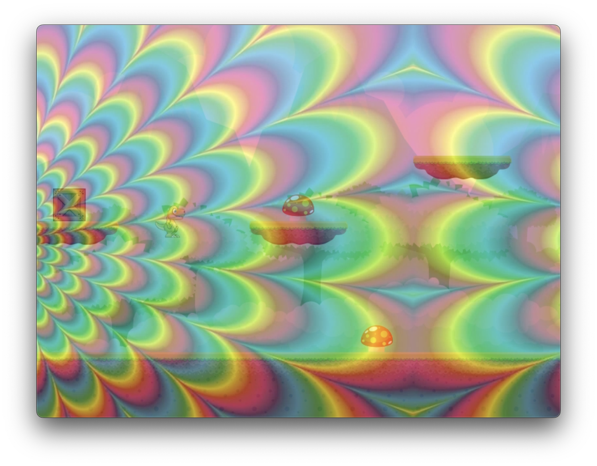
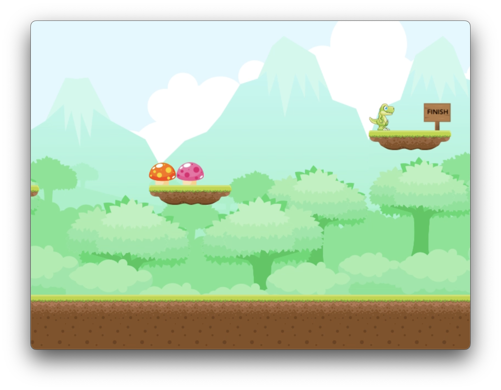

# Visual Computing

Visual Computing, ein Projekt von Robert Ackermann. Made with ♥ and ☕ in Erfurt.

## Allgemein

Dieses Projekt ist im Rahmen des Moduls Visual Computing an der Fachhochschule Erfurt entstanden.

## Anmerkungen

Im Spiel wurden zwei verschiedene Arten von Pilzen integriert. Die eine Sorte Pilz ermöglicht es dem Spieler auf eine spirituelle Reise zu gehen. Die andere Sorte sorgt jedoch für einen raschen Tot des Spielenden.
Es gibt zwei verschiedene Level, die der Spielende erkunden kann. Wie man zwischen den Leveln wechselt, wird unter dem Punkt Steuerung erklärt.

## Steuerung

Im Hauptmenü des Spiels kann per Druck auf die Tasten **1** bzw. **2** das gewünschte Level eingestellt werden. Eine kurze Meldung gibt anschließend Feedback darüber welches Level ausgewählt wurde. Mit den Pfeiltasten **hoch** und **runter** kann der Spielende auswählen ob er das Spiel starten oder beenden möchte. Mit einem Druck auf **Enter** wird dann die gewünschte Aktion ausgeführt. Wenn der Spielende im Hauptmenü die **Esc** Taste drückt wird das Spiel beendet.

Wurde das Spiel gestartet, so erfolgt die Steuerung des Charakters mit den Pfeiltasten nach links und rechts, um in die gewünschte Richtung zu laufen. Der Charakter kann per Druck auf die **Leertaste** zum springen motiviert werden. Drückt der Spielende im Spiel die **Esc** Taste, so gelangt er zurück ins Hauptmenü.

## Erstellung von Levels

Für die einfache Generierung bzw. Anzeige von Levels wurde das Tool [Visual Computing Level Preview](https://www.github.com/batzlov/visual-computing-level-preview) implementiert.

## Quelle der Assets

Die Assets stammen von der Plattform [GAME ART 2D](https://www.gameart2d.com/).

## Sonstiges

### Screenshots

### Bekannte Fehler

-   Projekt lässt sich aktuell im Release Modus nicht bauen und starten, Fehler: LNK1181 - Eingabedatei "tinyxml2.libkernel32.lib" kann nicht geöffnet werden	

