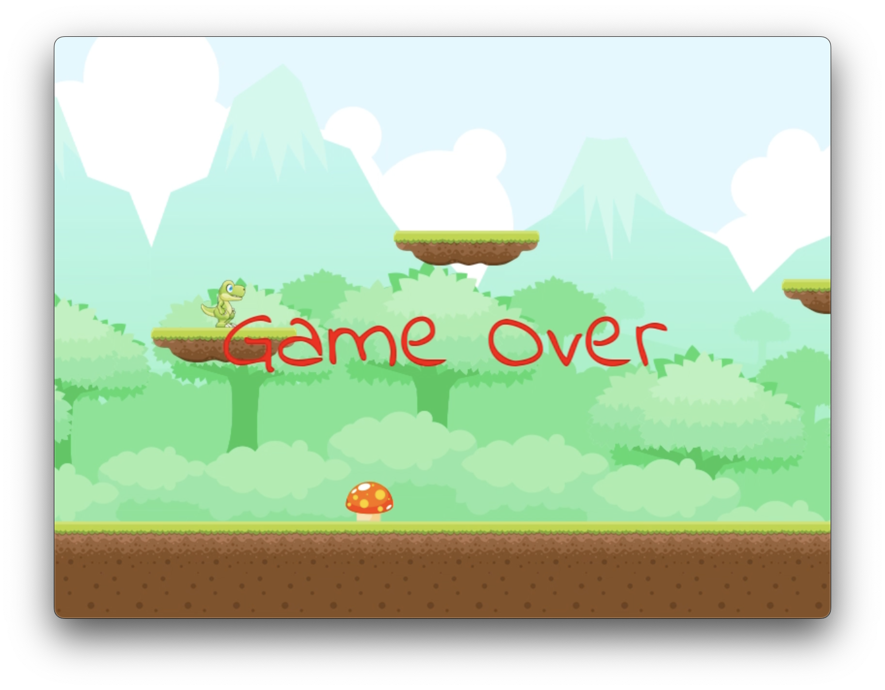

# Visual Computing

Visual Computing, ein Projekt von Robert Ackermann. Made with ♥ and ☕ in Erfurt.

## Allgemein

Dieses Projekt ist im Rahmen des Moduls Visual Computing an der Fachhochschule Erfurt entstanden.

### Quelle der Assets

Die Assets stammen von der Plattform [GAME ART 2D](https://www.gameart2d.com/).

### Screenshots

### Bekannte Fehler

-   Wenn ein Spieler von einem Objekt hinunterläuft, kann es sein, das er im Objekt stecken bleibt
-   wird in Kürze ergänzt
